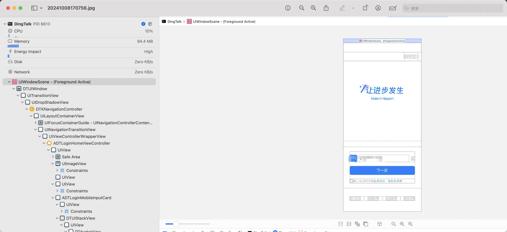

### XcodeAnyDebugRootless

## 简介

 XcodeAnyDebugRootless 让你能够使用 Xcode 调试任意 iOS 应用。基于 Dopamine 越狱环境开发,提供安全稳定的调试体验。

## 主要特性

- 支持调试任意已安装的 iOS 应用（包括 App Store 上下载的）
- 完全兼容 Dopamine 越狱环境
- 采用无根设计,安全可靠
- 无需配置直接使用

## 要求

- 已越狱的 iOS 设备 (使用 Dopamine)
- 安装了 Xcode 的 Mac 电脑

## 注意事项

本工具仅供开发学习使用,请遵守相关法律法规。
